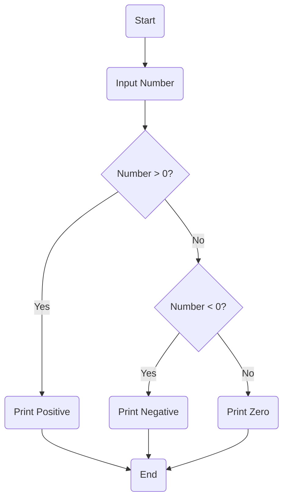

# Control Flow — If, Else, Elif Patterns

### 🧠 FOUNDATIONAL THEORY

#### 1\. **Decision-Making in Programs**

Imagine your daily life. You constantly make decisions: "If it's raining, I'll take an umbrella. Else, I'll walk without one." Or, "If I finish my work early, I can watch a movie. Otherwise, I'll keep working." These choices, based on certain conditions, guide your actions.

Just like us, computer programs need to make decisions to adapt to different situations, process varied inputs, and execute specific tasks. This ability to make choices is the core of **conditional logic** or **decision-making** in programming.

**Why Conditional Logic Exists:**

1.  **Adaptability:** Programs aren't static. They interact with users, data, and external systems that constantly change. Conditional logic allows a program to respond dynamically to these changes.
      * *Example:* A website might show a "Login" button if a user is not authenticated, but a "Profile" link if they are.
2.  **Handling Diverse Inputs:** Not all inputs are the same. A program needs to behave differently based on the type, value, or format of data it receives.
      * *Example:* A calculator needs to perform addition if the user enters `+`, subtraction if `-`, and so on.
3.  **Error Handling & Validation:** Programs need to ensure data is valid and prevent crashes. Conditional logic helps check for erroneous inputs or unexpected states.
      * *Example:* Before dividing two numbers, a program should check if the divisor is zero to avoid a `ZeroDivisionError`.
4.  **Implementing Business Rules:** Most applications embody specific business rules, which are inherently conditional.
      * *Example:* "Customers spending over ₹5000 get a 10% discount."
5.  **Controlling Program Flow:** Conditional statements dictate the exact path of execution a program takes, skipping certain blocks of code and executing others based on conditions.

-----

**Mapping Real-World Decision Trees to `if/else` Structures:**

A powerful way to think about conditional logic is by visualizing real-world decision processes as "decision trees." Each branch represents a condition, and each leaf represents an action.

Let's take the "morning routine" example:

**Real-World Decision Tree:**

  * **Start:** Wake Up
      * **Condition:** Is it a weekday?
          * **YES:**
              * **Condition:** Do I have an early meeting?
                  * **YES:** Get dressed quickly.
                  * **NO:** Have a leisurely breakfast.
              * Go to work.
          * **NO (Weekend):**
              * Sleep in.
              * Do chores.
      * **End:** Day continues.

**Mapping to `if/else` Structure (Conceptual Code):**

```python
# Simplified Conceptual Code

is_weekday = True
has_early_meeting = False # Or True, depending on the day

if is_weekday:
    # This block executes only if it's a weekday
    if has_early_meeting: # Nested decision
        print("Get dressed quickly.")
    else:
        print("Have a leisurely breakfast.")
    print("Go to work.")
else:
    # This block executes only if it's NOT a weekday (i.e., weekend)
    print("Sleep in.")
    print("Do chores.")

print("Day continues.")
```

**Key Takeaways from Mapping:**

  * **Conditions:** Real-world questions ("Is it raining?", "Is it a weekday?") become **Boolean expressions** (expressions that evaluate to `True` or `False`).
  * **Actions:** What you do based on the answer ("Take umbrella," "Go to work") become **blocks of code** that execute if the condition is met.
  * **Alternatives:** The "otherwise" or "else" scenarios are handled by `else` or `elif` (else if) clauses, ensuring that different paths are taken based on different conditions.
  * **Nesting:** Decisions can be nested within other decisions, just like branches on a tree can have sub-branches.

-----

**Flowchart to Code Mapping:**

Flowcharts are visual diagrams that represent the steps and decisions in a process. They are excellent tools for designing and understanding control flow before writing actual code.

**Common Flowchart Symbols:**

  * **Oval (Terminal):** Start or End of a process.
  * **Rectangle (Process):** An action or operation.
  * **Diamond (Decision):** A point where a decision is made, usually with "Yes/No" or "True/False" branches.
  * **Arrow (Flow Line):** Indicates the direction of flow.

**Example: Check if a number is positive, negative, or zero.**

**Flowchart:**




**Mapping to Python `if/elif/else` Code:**

```python
# Python Code
number = float(input("Enter a number: ")) # Input Number

if number > 0: # Number > 0? (Decision Diamond)
    print("Positive") # Print "Positive" (Process Rectangle)
elif number < 0: # Number < 0? (Decision Diamond)
    print("Negative") # Print "Negative" (Process Rectangle)
else: # If neither of the above conditions is met
    print("Zero") # Print "Zero" (Process Rectangle)

# The program naturally ends after one path is executed.
```

**Key Principles for Flowchart-to-Code:**

  * **Diamond Shapes** directly translate to `if` or `elif` statements, representing a condition.
  * **Rectangles** translate to the code blocks (indented lines) that execute if a condition is met.
  * **Flow Lines** indicate the sequence of execution. Multiple lines converging into one point (e.g., to `End`) show that different paths eventually lead to the same subsequent step.

Understanding this mapping helps you break down complex logic into manageable, visual steps, making it easier to write correct and efficient conditional code.

#### 2\. **Boolean Evaluation (Deep Dive)**

In Python, everything is an object, and every object has a truth value. Understanding how Python determines this truth value—and how it evaluates expressions built from them—is crucial for writing robust and efficient conditional logic.

-----

**The `bool()` Constructor and Implicit Casting Rules**

The `bool()` constructor is a built-in function that explicitly converts a value into its Boolean equivalent, `True` or `False`. While you can always call `bool(value)`, Python also performs this conversion implicitly in conditional statements.

The rules for what is considered **Falsy** (evaluates to `False`) and **Truthy** (evaluates to `True`) are fundamental:

**Falsy Values:**

  * `None`: The null object.
  * `False`: The Boolean false value.
  * Numeric zero of all types: `0`, `0.0`, `0j` (complex).
  * Empty sequences: `''` (empty string), `()` (empty tuple), `[]` (empty list), `{}` (empty dictionary), `set()` (empty set).
  * Empty ranges: `range(0)`.
  * Objects with a `__bool__()` method that returns `False` or a `__len__()` method that returns `0`.

**Truthy Values:**

  * **Anything that is not Falsy.** This includes:
  * `True`: The Boolean true value.
  * Non-zero numbers: `1`, `42`, `-1`, `3.14`.
  * Non-empty sequences or collections: `"hello"`, `(1, 2)`, `[1]`, `{"key": "value"}`.
  * Any custom object that doesn't define a `__bool__()` or `__len__()` method, or whose `__bool__()` method returns `True`.

**Example:**

```python
x = 5
y = ""
z = [1, 2]
d = {}

print(f"Is x (5) Truthy? {bool(x)}")     # Output: Is x (5) Truthy? True
print(f"Is y (empty string) Falsy? {bool(y)}") # Output: Is y (empty string) Falsy? False
print(f"Is z ([1, 2]) Truthy? {bool(z)}") # Output: Is z ([1, 2]) Truthy? True
print(f"Is d (empty dict) Falsy? {bool(d)}") # Output: Is d (empty dict) Falsy? False

# Implicit casting in an if statement
if d:
    print("This will not be printed because d is an empty dictionary.")
else:
    print("d is falsy, so this is printed.")
```

-----

**Operator Precedence in Boolean Logic**

When a condition involves multiple logical operators, Python follows a strict order of precedence to determine which operation to perform first.

From highest precedence to lowest:

1.  **`not`**: Unary logical NOT.
2.  **`and`**: Logical AND.
3.  **`or`**: Logical OR.

This means `not` binds most tightly, followed by `and`, and finally `or`. You can always override this default order with parentheses `()`.

**Example:**

```python
A = True
B = False
C = False

# Expression: not A or B and C
# This is evaluated as: (not A) or (B and C)
#
# Step 1: `not A` -> `not True` -> `False`
# Step 2: `B and C` -> `False and False` -> `False`
# Step 3: `False or False` -> `False`
result = not A or B and C
print(f"Result of 'not A or B and C' is: {result}") # Output: False

# Using parentheses to change precedence
result_with_parens = not (A or B) and C
# Step 1: `(A or B)` -> `(True or False)` -> `True`
# Step 2: `not (True)` -> `False`
# Step 3: `False and C` -> `False and False` -> `False`
print(f"Result of 'not (A or B) and C' is: {result_with_parens}") # Output: False

# Let's try another one where precedence matters more
A = True
B = False
C = True
result = not B or A and C
# (not B) or (A and C)
# -> (True) or (True)
# -> True
print(f"Result of 'not B or A and C' is: {result}") # Output: True
```

**Key Takeaway:** If you are ever in doubt about the order of evaluation, use parentheses to make your intentions explicit and your code more readable.

-----

**Internals: How Python Evaluates Composite Conditions**

Python's evaluation of Boolean expressions is highly optimized and often uses a technique called **short-circuiting**. This means that not all parts of a composite condition are necessarily evaluated. The evaluation stops as soon as the final outcome is known.

  * **For `and`:** The expression `A and B` is evaluated from left to right.
      * If `A` is **Falsy**, Python stops immediately and returns the value of `A`. It doesn't even look at `B`.
      * If `A` is **Truthy**, Python then evaluates `B` and returns the value of `B`.
  * **For `or`:** The expression `A or B` is evaluated from left to right.
      * If `A` is **Truthy**, Python stops immediately and returns the value of `A`. It doesn't even look at `B`.
      * If `A` is **Falsy**, Python then evaluates `B` and returns the value of `B`.
  * **For `not`:** `not A` always evaluates `A` first and then returns `False` if `A` is Truthy, or `True` if `A` is Falsy. There is no short-circuiting.

**Important Note:** The short-circuiting behavior means that `and` and `or` don't always return a Boolean (`True` or `False`). They return the value of the last expression evaluated.

**Example of Short-Circuiting with Side Effects:**

```python
def check_connection():
    print("Checking network connection...")
    return False

def check_database():
    print("Checking database status...")
    # This function will never be called due to short-circuiting
    return True

# A and B: 'A' is Falsy, so the expression stops at 'A'
print("\n--- Testing `and` short-circuit ---")
result_and = check_connection() and check_database()
print(f"Result of `and`: {result_and}") # The result is the value of check_connection(), which is False

def get_username():
    print("Getting username...")
    return "Alice"

def get_default():
    print("Getting default user...")
    # This function will never be called
    return "Guest"

# A or B: 'A' is Truthy, so the expression stops at 'A'
print("\n--- Testing `or` short-circuit ---")
result_or = get_username() or get_default()
print(f"Result of `or`: {result_or}") # The result is the value of get_username(), which is "Alice"
```

**Key Takeaway:** Short-circuiting is a powerful optimization that prevents unnecessary computation and is often used to write clean, Pythonic code, such as `if my_list and my_list[0] == 42:`. This prevents an `IndexError` if the list is empty.
### 🔍 COMPREHENSIVE CONTROL FLOW TOOLS

#### 3\. **Python’s Control Constructs**

Python offers several constructs for managing the flow of execution in your programs. These constructs allow you to test conditions and execute different blocks of code accordingly. The choice of which construct to use depends on the complexity of your decision logic.

Let's break down the primary tools:

| Construct    | Purpose                                    | Example               |
|--------------|--------------------------------------------|-----------------------|
| `if`         | **Test a single condition.** The simplest form of conditional logic. The code block is executed only if the condition evaluates to `True`.  | `if age > 18:`       |
| `elif`       | **Test additional, mutually exclusive condition(s).** Stands for "else if." An `elif` block is checked only if all preceding `if` and `elif` conditions were `False`. You can have multiple `elif` blocks. | `elif age == 18:`     |
| `else`       | **Catch-all fallback.** An `else` block is executed if and only if all preceding `if` and `elif` conditions in the same chain were `False`. It's an optional, final resort. | `else:`               |
| `match-case` | **Pattern-based conditional.** (Available in Python 3.10 and later). Provides a more structured and readable way to handle multiple potential values or complex data structures. It's often a more powerful alternative to long `if/elif` chains. | `match status:`       |

-----

#### **Detailed Breakdown with Examples**

**1. The `if` Statement: The Single Condition**

The `if` statement is the foundation of decision-making. If the condition is `True`, the indented block of code runs. If it's `False`, the block is skipped entirely.

```python
is_raining = True

if is_raining:
    print("Remember to take an umbrella!")
    print("You might also want to wear a raincoat.")

print("The day continues.")
```

**2. The `if`/`else` Statement: The Binary Choice**

An `if/else` block handles a binary decision. If the `if` condition is `True`, the `if` block executes. If it's `False`, the `else` block is executed. Only one of these two blocks will ever run.

```python
age = 25

if age >= 18:
    print("You are eligible to vote.")
else:
    print("You are not yet old enough to vote.")
```

**3. The `if`/`elif`/`else` Chain: The Multi-Option Decision**

This is used for situations where you have multiple, mutually exclusive conditions to check. Python evaluates the conditions in order, from top to bottom. The first condition that evaluates to `True` will have its block executed, and all subsequent `elif` and `else` blocks will be skipped.

```python
score = 85

if score >= 90:
    print("Grade: A")
elif score >= 80:
    # This block runs because 85 >= 80, and the previous condition was False.
    print("Grade: B")
elif score >= 70:
    # This block is not even checked because the previous 'elif' was already true.
    print("Grade: C")
else:
    print("Grade: F")
```

**Key Principles:**

  * The `if` statement is required to start the chain.
  * `elif` and `else` are optional.
  * Only **one** block in the entire `if`/`elif`/`else` chain will be executed.

**4. The `match-case` Statement (Python 3.10+)**

`match-case` is designed for pattern matching and is a powerful alternative to long, repetitive `if/elif` chains, especially when you are checking a single variable against multiple potential values or structures.

```python
def handle_http_status(status_code):
    match status_code:
        case 200:
            print("OK - The request was successful.")
        case 404:
            print("Not Found - The requested resource could not be found.")
        case 500 | 501 | 502: # You can match multiple values
            print("Server Error - Something went wrong on the server.")
        case _:
            # The underscore '_' acts as a wildcard, equivalent to an `else` block.
            print(f"Unknown status code: {status_code}")

# Test the function
handle_http_status(200)   # Output: OK - The request was successful.
handle_http_status(404)   # Output: Not Found - The requested resource could not be found.
handle_http_status(502)   # Output: Server Error - Something went wrong on the server.
handle_http_status(403)   # Output: Unknown status code: 403
```

**Key Principles:**

  * The `match` statement takes an expression and compares it to the patterns in each `case` block.
  * `case` blocks are checked in order.
  * The first `case` that successfully "matches" the expression has its code executed.
  * The optional wildcard `_` acts as a final catch-all, similar to an `else` block.

`match-case` can also be used for more complex pattern matching, which we'll explore in a later section. For now, understand it as a cleaner way to handle multiple discrete conditions.

### The Flow Pyramid: A Hierarchical Model for Control Flow

The Flow Pyramid is a design principle that provides a structured, hierarchical approach to choosing the most effective control flow mechanism in Python. It is not a rigid set of rules, but rather a strategic model that guides a developer from simple, direct solutions to more advanced, scalable patterns that minimize code complexity and improve readability. The model is structured like a pyramid, with the most fundamental and universally applicable constructs forming the base and increasingly powerful, specialized patterns ascending to the apex.

The core philosophy of this model is to:

  * **Prioritize Readability:** Favour code that is easy to understand and reason about, reducing cognitive load for developers.
  * **Enhance Maintainability:** Choose patterns that simplify future changes and extensions without causing cascading modifications to existing code.
  * **Promote Efficiency:** Select constructs that are not only clear but also computationally efficient for their specific use case.

The hierarchy ascends through five distinct levels, each building upon the last and offering a more refined solution for specific types of conditional logic.

**The Flow Pyramid Design Principle:**

| Pyramid Level       | Principle & Purpose                                                                                                                                                             |
| ------------------- | ------------------------------------------------------------------------------------------------------------------------------------------------------------------------------- |
| **Base** (`if`)     | **Use `if` for binary decisions.** The most fundamental choice. If you have a single condition that branches to one of two outcomes (`if/else`), `if` is the clearest tool for the job. |
| **Second Level** (`elif`) | **Use `elif` for mutual exclusivity.** When you have a series of related, mutually exclusive conditions (e.g., grading a score, classifying a number), a single `if/elif/else` chain is the most efficient and readable approach. It guarantees only one path is taken. |
| **Third Level** (Early Exits) | **Use early `return` or `continue` to flatten logic.** Avoid deep nesting. A "guard clause" at the top of a function that returns early for invalid input is far more readable than nesting the entire function body within a large `if` statement. |
| **Fourth Level** (`match-case`) | **Use `match-case` for structured pattern control.** When your logic involves checking a single variable against multiple potential values or a complex data structure, `match-case` (Python 3.10+) provides a clean, declarative, and highly readable solution that avoids messy `if/elif` chains. |
| **Peak** (Functional) | **Use dictionaries for functional mapping.** The most advanced and flexible pattern. When you have a fixed set of inputs that each map to a specific action (e.g., a function call), using a dictionary to map input strings to handler functions is incredibly powerful, scalable, and eliminates conditional logic entirely. |


-----

### Level 1: The Base - The `if/else` Statement

**Principle:** Employ `if/else` for binary decision logic.

**Explanation:**
This is the foundational level of the pyramid, representing the simplest form of conditional control. It is designed for situations where a single condition dictates a choice between two mutually exclusive outcomes. The `if/else` construct is the most direct and semantically honest way to express a two-way branch, such as checking if a user is authenticated or not.

**Example: User Authentication Check**

```python
# A variable representing a user's session state
is_user_authenticated = True

if is_user_authenticated:
    # This block executes if the user is logged in
    print("Welcome, you are logged in. Accessing your dashboard...")
else:
    # This block executes if the user is a guest
    print("You are not logged in. Please log in to continue.")
```

In this code, the `if` condition `is_user_authenticated` evaluates to `True`, so the program executes the first `print` statement. This is a simple, clear binary decision: authenticated or not authenticated.

-----

### Level 2: The Step-Up - The `if/elif/else` Chain

**Principle:** Utilize `if/elif/else` for a series of mutually exclusive conditions.

**Explanation:**
Ascending the pyramid, this level addresses scenarios where a single value must be classified into one of multiple distinct categories. The `if/elif/else` chain provides a structured and efficient mechanism for this, such as handling different types of HTTP status codes in a web application.

The interpreter evaluates each condition in a top-down sequence. The moment a condition evaluates to `True`, its corresponding code block is executed, and the program immediately "short-circuits" the rest of the chain, skipping all subsequent `elif` and `else` blocks. This ensures that only one block of code is executed, which is crucial for handling a sequence of ordered checks.

**Example: Handling HTTP Response Status Codes**

```python
# A common problem: processing different server responses
def handle_http_response(status_code):
    if status_code == 200:
        print("Success: The request was successful.")
    elif status_code == 404:
        print("Client Error: Resource not found.")
    elif status_code == 401:
        print("Authentication Error: Unauthorized access.")
    elif status_code == 500:
        print("Server Error: Internal server error.")
    else:
        print(f"Informational: Unhandled status code {status_code}.")

# For a status code of 401, the execution path is:
# 1. `if status_code == 200` is False.
# 2. `elif status_code == 404` is False.
# 3. `elif status_code == 401` is True. The block is executed, printing "Authentication Error...".
# 4. The program short-circuits and skips the remaining `elif` and `else` blocks.
```

-----

### Level 3: The Indentation Killer - Guard Clauses & Early Exits

**Principle:** Employ `return` or `continue` to flatten logical structures and minimize nesting.

**Explanation:**
This level addresses a critical issue in code readability: excessive indentation caused by deeply nested `if` statements. Such code structures, often referred to as the "Arrow Anti-Pattern," significantly increase cognitive load. A **guard clause** is a conditional statement at the beginning of a function that checks for invalid or "unhappy path" conditions. By returning early from the function when a precondition is not met, the main body of the function—the "happy path" or core logic—can remain at a flat, unindented level.

**Example: Data Validation in an API Endpoint**

```python
# The Flattened approach using Guard Clauses
# This function simulates processing a new user registration request
def register_user(user_data):
    if not isinstance(user_data, dict):
        return {"error": "Invalid data format."}, 400
    if "username" not in user_data:
        return {"error": "Username is required."}, 400
    if len(user_data["username"]) < 5:
        return {"error": "Username must be at least 5 characters long."}, 400
    if "email" not in user_data or "@" not in user_data["email"]:
        return {"error": "Valid email is required."}, 400

    # The "happy path" is now clean and easy to read
    # All invalid cases are handled above.
    print(f"User '{user_data['username']}' with email '{user_data['email']}' registered successfully.")
    return {"message": "Registration successful."}, 201
```

The function is highly readable because it handles failure states sequentially and upfront, allowing the successful execution logic to be presented clearly without deep nesting.

-----

### Level 4: The Modern Alternative - `match-case` (Python 3.10+)

**Principle:** Use `match-case` for structured pattern-based control.

**Explanation:**
Available in Python 3.10 and later, the `match-case` statement provides a powerful, declarative alternative to `if/elif` chains, especially when dealing with discrete values or complex data structures. This construct is well-suited for routing based on the structure of a data object, such as a user-supplied command or a message from an external system.

**Example: Processing User Commands in a CLI Application**

```python
# The problem: Process a user command that could be a single action or an action with arguments
def process_cli_command(command_list):
    match command_list:
        # Matches a list with exactly one element: "help"
        case ["help"]:
            print("Usage: status | start <service> | stop <service>")
        
        # Matches a list with two elements, specifically ["start", service]
        case ["start", service]:
            print(f"Starting service: {service}...")

        # Matches a list with two elements, specifically ["stop", service]
        case ["stop", service]:
            print(f"Stopping service: {service}...")

        # The wildcard pattern, acting as a fallback
        case _:
            print(f"Unknown command: {' '.join(command_list)}")

# Test cases for the match statement:
process_cli_command(["start", "web_server"])
process_cli_command(["status"])
process_cli_command(["help"])
```

This approach is more robust and readable than using a series of `if/elif` statements with manual index checks, which are susceptible to `IndexError` if the command list is shorter than expected.

-----

### Level 5: The Apex - Functional Mapping with Dictionaries

**Principle:** Utilize dictionaries to map actions (functions) to keys, effectively replacing conditional logic.

**Explanation:**
This is the most advanced and flexible pattern in the pyramid. It completely removes the need for explicit conditional statements by leveraging a dictionary as a **dispatcher table**. Here, the keys of the dictionary are the conditions (e.g., user roles, command strings), and the values are the function objects themselves that should be executed.

This pattern is a powerful implementation of the **Open/Closed Principle**: the core execution logic is "closed" to modification, while the system is "open" for extension. To add a new command or a new user role, a developer only needs to add a new key-value pair to the dictionary, without altering the existing dispatcher code.

**Example: Role-Based Authorization**

```python
# Define handler functions for each user role
def show_admin_dashboard():
    print("Redirecting to the admin dashboard.")

def show_user_profile():
    print("Redirecting to the user's profile page.")

def show_guest_page():
    print("Redirecting to the public home page.")

# A dictionary that serves as a dispatcher table for authorization
authorization_handlers = {
    "admin": show_admin_dashboard,
    "user": show_user_profile,
    "guest": show_guest_page
}

# The single point of execution for the authorization logic
user_role = "user" # This would come from a database or token
user_role_from_db = "guest"

# 1. Retrieve the function object from the dictionary using the role as the key.
# 2. Use the .get() method with a default value (show_guest_page) for graceful handling of unknown roles.
handler = authorization_handlers.get(user_role_from_db, show_guest_page)

# 3. Call the function object returned by .get().
handler()

# To add a new "moderator" role, you would only add:
# authorization_handlers["moderator"] = show_moderator_page
# The rest of the authorization logic remains unchanged.
```

This elegant pattern replaces an entire `if/elif/else` chain with a single, highly readable lookup and function call, making the system easy to extend and maintain.

### 🧱 EXTENDED PATTERNS & PYTHONIC APPLICATIONS

#### 5\. **Flattening vs. Nesting Logic**

This principle is a direct application of the Zen of Python's maxim, *"Flat is better than nested."* It is a fundamental concept for writing readable and maintainable code. The goal is to avoid deeply indented code blocks, which can make logic difficult to follow and increase the potential for errors.

**The Problem with Nested Logic (The "Arrow Anti-Pattern"):**

When conditional logic is nested, a developer must keep multiple conditions in mind simultaneously to understand under what circumstances a piece of code will execute. Each additional level of indentation increases cognitive load, making the code harder to read and debug. This is often called the "arrow anti-pattern" because the code's indentation forms a shape that looks like an arrowhead pointing to the right.

**Example of Nested Logic (`Bad`):**

```python
# Problem: This code is deeply nested. To understand when "Welcome!" is printed,
# you must track two separate conditions across two different indentation levels.
def login_nested(user):
    if user:
        if user.get("active") is True:
            if user.get("last_login_date") is not None:
                print("Welcome back, user!")
                # ... imagine more code here
            else:
                print("Welcome, new user!")
    else:
        print("Please log in.")
```

**The Solution: Flattening Logic**

Flattening logic involves combining multiple conditions into a single, more expressive conditional statement using the `and` and `or` logical operators. This reduces the number of indentation levels and presents all the necessary conditions at once, making the code's intent immediately clear.

**Example of Flattened Logic (`Better`):**

```python
# The "Better" approach: Combine conditions with the 'and' operator
def login_flat(user):
    # This single line of code explicitly states all conditions for the welcome message
    if user and user.get("active") is True and user.get("last_login_date") is not None:
        print("Welcome back, user!")
    elif user and user.get("active") is True:
        print("Welcome, new user!")
    else:
        print("Please log in.")
```

**Key Advantages of Flattened Logic:**

  * **Improved Readability:** All conditions required for a block of code to execute are visible on a single line, eliminating the need to mentally track multiple indentation levels.
  * **Reduced Cognitive Load:** The code is easier to process and understand, as the logical flow is presented horizontally rather than vertically.
  * **Fewer Bugs:** The short-circuiting behavior of the `and` operator (as discussed in the `Boolean Evaluation` section) prevents potential errors. In the example `if user and user.get("active"):`, Python will not attempt to access `user.get("active")` if `user` is `None`, thus avoiding an `AttributeError`.
  * **Easier Refactoring:** Flattened code is more modular and easier to modify or extract into separate functions.

This pattern is also closely related to the use of **guard clauses**, which are another powerful technique for flattening code by handling invalid conditions with an early `return` or `continue` statement.


#### 6\. **EAFP vs. LBYL**

Python developers often encounter a choice between two distinct philosophical approaches to handling potential errors when accessing data: **EAFP** and **LBYL**. These acronyms represent two common coding styles, and understanding them is crucial for writing idiomatic and robust Python code.

-----

**LBYL: "Look Before You Leap"**

**Principle:** Proactively check for a condition before performing an action that might fail.

**Detailed Explanation:**
The "Look Before You Leap" style is a cautious, defensive approach. It involves using conditional statements (like `if`, `in`, `isinstance`) to verify that an operation is safe to perform before attempting it. This style is common in other programming languages and is very intuitive for beginners.

The core idea is to prevent errors by checking for their potential cause ahead of time.

**Example:**

```python
# LBYL style
data = {"name": "Alice", "age": 30}
key_to_find = "email"
email = None

if key_to_find in data:
    # We check if the key exists before attempting to access it
    email = data[key_to_find]
else:
    # Handle the case where the key doesn't exist
    email = "Not available"

print(f"The email is: {email}") # Output: The email is: Not available
```

**Pros of LBYL:**

  * **Predictable Flow:** The code's execution path is straightforward and easy to follow.
  * **Explicit:** All potential conditions are explicitly handled with `if/else` logic.

**Cons of LBYL:**

  * **Race Conditions:** In a multi-threaded environment, an LBYL check could become invalid between the check and the action. For example, a key might exist when you check for it, but another thread could delete it before you access it, still leading to a `KeyError`.
  * **Verbose:** For complex checks, the code can become cluttered with multiple `if` statements.

-----

**EAFP: "Easier to Ask Forgiveness than Permission"**

**Principle:** Attempt the action directly and handle any exceptions that occur.

**Detailed Explanation:**
The "Easier to Ask Forgiveness than Permission" style is a more optimistic, "Pythonic" approach. It assumes that an operation will succeed and wraps the potentially risky code in a `try...except` block. If an exception occurs, the `except` block catches it and handles the error gracefully.

This style avoids the explicit checking of LBYL and is often more concise and efficient for operations that are expected to succeed most of the time.

**Example:**

```python
# EAFP style
data = {"name": "Alice", "age": 30}
key_to_find = "email"
email = None

try:
    # Attempt to access the key directly
    email = data[key_to_find]
except KeyError:
    # Handle the specific exception that would occur if the key is missing
    email = "Not available"

print(f"The email is: {email}") # Output: The email is: Not available
```

**Pros of EAFP:**

  * **Concise and Clean:** It often results in less cluttered code by focusing on the "happy path" first.
  * **Robust against Race Conditions:** EAFP handles the failure at the exact moment it occurs, making it inherently safe in multi-threaded environments.
  * **Efficiency:** For operations where the "happy path" is common, EAFP is often faster as it avoids the overhead of a redundant check. The `try...except` block only incurs a performance penalty when an exception is actually raised.

**Cons of EAFP:**

  * **Can Obscure Flow:** For beginners, the flow of a `try...except` block might be less intuitive than a simple `if` statement.
  * **Overly Broad Exception Handling:** A poorly written `except` block (e.g., `except Exception:`) can hide legitimate bugs and make debugging difficult. It's crucial to catch only specific exceptions (`KeyError`, `IndexError`, etc.).

-----

**Conclusion:**

While both styles are valid, **EAFP is often considered more "Pythonic"** because it embraces Python's robust exception handling system. It leads to cleaner, more efficient code, especially when dealing with operations that are likely to succeed.

For a simple check like `if x is None:`, LBYL is perfectly acceptable and often more readable. However, for operations that could raise various exceptions (e.g., file I/O, network requests, or dictionary lookups in complex scenarios), EAFP provides a more elegant and powerful solution. The key is to choose the style that best communicates the intent of your code and results in the most readable and maintainable solution.


#### 7\. **Chained Conditionals with `all()` / `any()`**

For scenarios involving multiple conditions, a common approach is to chain them together using `and` or `or` operators. However, Python provides two built-in functions, `all()` and `any()`, that offer a more readable and powerful way to handle these composite conditions, especially when dealing with iterables.

-----

**The `all()` Function**

**Principle:** The `all(iterable)` function returns `True` if all elements in the given iterable are truthy. If the iterable is empty, it returns `True`.

**Detailed Explanation:**
`all()` is a concise and expressive way to verify that every item in a collection meets a specific condition. It takes any iterable (like a list, tuple, or generator expression) and returns `True` only if every element would evaluate to `True` in a Boolean context.

This approach is superior to chaining multiple `and` statements, particularly when the number of conditions is dynamic or large.

**Example: Verifying user input**

```python
# Problem: A user needs to enter three valid, non-negative ages.
user_ages = [25, 18, 45]

# The traditional, verbose way
if user_ages[0] >= 0 and user_ages[1] >= 0 and user_ages[2] >= 0:
    print("All ages are non-negative.")

# The Pythonic, scalable way with all()
# We use a generator expression for efficiency (it's short-circuited).
if all(age >= 0 for age in user_ages):
    print("All ages are non-negative.")

# Another example: Checking if all items in a list are truthy
my_list = [1, "hello", True, 42]
print(f"Are all items truthy? {all(my_list)}") # Output: Are all items truthy? True

my_list_with_falsy = [1, "hello", 0, True]
print(f"Are all items truthy? {all(my_list_with_falsy)}") # Output: Are all items truthy? False
```

**Key Takeaway:** The `all()` function short-circuits. As soon as it encounters the first falsy element in the iterable, it stops processing and immediately returns `False`. This makes it highly efficient.

-----

**The `any()` Function**

**Principle:** The `any(iterable)` function returns `True` if at least one element in the given iterable is truthy. If the iterable is empty, it returns `False`.

**Detailed Explanation:**
`any()` is the counterpart to `all()`. It is designed to check for the existence of at least one item that meets a specific condition. This is far more readable than chaining multiple `or` statements.

**Example: Checking for a specific role**

```python
# Problem: We need to know if a user has at least one of a set of required roles.
user_roles = ["guest", "editor"]
required_roles = ["admin", "editor"]

# The traditional, verbose way
if "admin" in user_roles or "editor" in user_roles:
    print("User has one of the required roles.")

# The Pythonic, scalable way with any()
if any(role in user_roles for role in required_roles):
    print("User has one of the required roles.")

# Another example: Checking for a specific status
statuses = ["pending", "processing", "success", "error"]
print(f"Is there an error status? {any(s == 'error' for s in statuses)}") # Output: Is there an error status? True
```

**Key Takeaway:** Similar to `all()`, the `any()` function also short-circuits. It stops processing and returns `True` as soon as it encounters the first truthy element.

-----

**Summary of Advantages:**

  * **Readability:** `all()` and `any()` express the programmer's intent more clearly than long chains of `and` or `or`. The code reads like a sentence: "If all of these conditions are true..."
  * **Scalability:** They are ideal for situations where the number of conditions is not fixed. You can easily add or remove conditions from the iterable without having to rewrite the core conditional logic.
  * **Efficiency:** Both functions short-circuit, which means they are as performant as their chained operator counterparts and often more efficient than explicitly looping through an entire collection.
  * **Generator Expressions:** Using a generator expression within `all()` or `any()` is a highly efficient pattern, as it avoids creating an intermediate list in memory.

-----

#### 8\. **Early Exits & Guards**

The concept of early exits, also known as **guard clauses**, is a powerful and widely-adopted design pattern for writing clean, readable, and maintainable code. It is a direct and practical implementation of the "Flattening vs. Nesting Logic" principle.


**Principle:**

A guard clause is a conditional statement that appears at the very beginning of a function or a method. Its purpose is to check for a specific, invalid condition (the "unhappy path") and immediately exit the function by using a `return`, `break`, or `continue` statement.

The philosophy is simple: **handle the exceptional or invalid cases first, so the rest of the code can focus on the successful execution path.**

-----

**The Problem with Deeply Nested Logic:**

Without guard clauses, developers often nest their code within a large `if` statement that checks for the "happy path." This leads to deeply indented code that is difficult to read and debug.

**Example of Nested Logic (`Bad`):**

```python
def get_user_email(user_data):
    # The 'happy path' logic is buried deep inside
    if user_data:
        if isinstance(user_data, dict):
            if "contact" in user_data:
                if "email" in user_data["contact"]:
                    email = user_data["contact"]["email"]
                    # ... more code here ...
                    return email
    return None # Return a default value if any condition fails
```

In this example, to understand what the function does, a developer must read through four levels of nested `if` statements. The "return" is a small piece of code surrounded by a lot of conditional logic.

-----

**The Solution: Early Exits & Guard Clauses (`Better`):**

The guard clause pattern reverses this logic. It checks for all the invalid conditions first.

**Example of Flattened Logic (`Better`):**

```python
def get_user_email_with_guards(user_data):
    # Guard clause 1: Check for falsy input (None, empty string, empty dict, etc.)
    if not user_data:
        return None

    # Guard clause 2: Check for incorrect data type
    if not isinstance(user_data, dict):
        return None

    # Guard clause 3: Check for missing nested keys
    if "contact" not in user_data or "email" not in user_data["contact"]:
        return None
    
    # All invalid cases have been handled. The remaining code is the "happy path."
    email = user_data["contact"]["email"]
    # ... rest of the main logic, now at a flat indentation level ...
    return email
```

This refactored function is far more readable. The preliminary checks are done at the top, and the main logic is presented cleanly and without deep indentation.

-----

**Key Advantages of Using Guard Clauses:**

1.  **Improved Readability and Scannability:** The "happy path" of the code is not indented, making it easy to see the primary purpose of the function at a glance. The code reads sequentially, like a list of instructions.
2.  **Reduced Cognitive Load:** Developers don't have to keep a mental stack of multiple active conditions. Each `if` statement is a simple "check and exit" operation.
3.  **Easier Debugging:** When a function returns unexpectedly, you can immediately see which guard clause was triggered, narrowing down the cause of the issue.
4.  **Better Code Maintainability:** It is much easier to add or remove a guard clause without impacting the core logic or causing significant refactoring.

**Application in Loops:**

Guard clauses are not limited to functions. They can also be used in loops to skip iterations that don't meet a specific criteria.

```python
# Guard clause with a loop
def process_data_items(data_list):
    for item in data_list:
        # Guard clause: skip this iteration if the item is None or not a string
        if not item or not isinstance(item, str):
            continue  # Skips to the next iteration of the loop
        
        # This code only runs for valid string items
        print(f"Processing item: {item.upper()}")
```

In this example, the `continue` statement acts as an early exit for a single iteration of the loop, ensuring that the rest of the code only operates on valid data.

### 🧰 ADVANCED STRUCTURAL PATTERNS

#### 9\. **`match-case` Deep Patterns (Python 3.10+)**

While `match-case` can be a simple alternative to `if/elif` for discrete values, its true power lies in its ability to perform advanced structural pattern matching. This allows you to check not only the value but also the shape and content of complex data structures like lists, tuples, and dictionaries, all in a single, readable statement.

-----

**1. Nested Destructuring**

This is one of the most powerful features of `match-case`. It allows you to match against nested structures and simultaneously extract, or "destructure," values from them into local variables.

**Example: Processing Structured Command Inputs**

Imagine a command-line interface where commands are represented as lists.

```python
def process_command(command):
    match command:
        # Matches a list with exactly three elements.
        # It binds the second element to the 'user' variable and the third to 'status'.
        case ["set", user, status]:
            print(f"Setting status for user '{user}' to '{status}'.")
        
        # Matches a list with one element and the value "report".
        case ["report"]:
            print("Generating system report...")
        
        # Matches a list with exactly two elements.
        # It binds the first to 'action' and the second to 'target'.
        case [action, target]:
            print(f"Unknown action: '{action}' on target '{target}'.")
        
        # The wildcard catch-all for any other pattern.
        case _:
            print("Invalid command structure.")

# The `match` statement intelligently extracts the data
process_command(["set", "alice", "active"])  # Output: Setting status for user 'alice' to 'active'.
process_command(["report"])                 # Output: Generating system report...
process_command(["delete", "log.txt"])      # Output: Unknown action: 'delete' on target 'log.txt'.
```

This pattern provides a robust and readable way to parse structured data without manual checks and indexing (`command[1]`, `command[2]`).

-----

**2. Combining with Guards**

A `match-case` statement can be combined with a guard (`if` clause) to add an extra layer of conditional logic to a pattern. The guard is a Boolean expression that is only evaluated if the pattern itself is a match. The `case` succeeds only if both the pattern and the guard condition are `True`.

**Example: Conditional Value Matching**

```python
def categorize_age(age):
    match age:
        # Pattern `x` always matches, but the guard `if x >= 18` acts as the real condition.
        case x if x >= 65:
            print("Senior citizen")
        case x if x >= 18:
            print("Adult")
        case x if x < 18:
            print("Minor")
        case _:
            print("Invalid age")

categorize_age(25)  # Output: Adult
categorize_age(70)  # Output: Senior citizen
```

While this can be replicated with `if/elif`, guards are particularly useful when combined with destructuring to add constraints on the extracted values. For instance, `case ["set", user, status] if status in ["active", "suspended"]:` ensures the status value is valid.

-----

**3. Matching on Class Instances**

`match-case` can also be used to match on the type of an object and its attributes. This provides a powerful way to handle different types of objects in a polymorphic way.

**Example: Handling Different Message Types**

Assume we have a base `Message` class and two subclasses, `TextMessage` and `ImageMessage`.

```python
# Conceptual classes for demonstration
class TextMessage:
    def __init__(self, content, author):
        self.content = content
        self.author = author

class ImageMessage:
    def __init__(self, url, author):
        self.url = url
        self.author = author

def process_message(message):
    match message:
        # Matches if `message` is an instance of `TextMessage`.
        # It also extracts the `content` and `author` attributes.
        case TextMessage(content=c, author=a):
            print(f"Text from {a}: '{c}'")
        
        # Matches if `message` is an instance of `ImageMessage`.
        case ImageMessage(url=u, author="admin"):
            print(f"Admin posted an image from URL: {u}")
        
        # Wildcard case for any other object
        case _:
            print(f"Unknown message type: {type(message)}")

# The `match` statement works based on the object's type and attributes
msg1 = TextMessage("Hello, World!", "user123")
msg2 = ImageMessage("http://image.com/pic.jpg", "admin")
msg3 = ImageMessage("http://other.com/photo.png", "guest")

process_message(msg1)  # Output: Text from user123: 'Hello, World!'
process_message(msg2)  # Output: Admin posted an image from URL: http://image.com/pic.jpg
process_message(msg3)  # Output: Unknown message type: <class '__main__.ImageMessage'> (due to the author="admin" check)
```

This pattern is extremely useful for routing and dispatching logic based on the type and properties of the data being processed, making it a highly readable alternative to a long `isinstance()` chain.

### 🧰 ADVANCED STRUCTURAL PATTERNS

#### 10\. **Functional Mapping of Logic**

Functional mapping is a highly advanced and elegant pattern that represents the pinnacle of the Flow Pyramid. Its objective is to completely eliminate conditional control flow (`if/elif/else`) by using a data structure—specifically a dictionary—to dispatch logic. Instead of writing `if/elif` statements to determine which function to call, you map a key to its corresponding callable function object.

-----

**Principle:**

The core principle is to use a dictionary as a **dispatcher table** or **lookup table**. The keys of this dictionary represent the conditions or states, and the values are the function objects themselves. The execution logic is then reduced to two simple steps:

1.  Look up the appropriate function in the dictionary using the dynamic key.
2.  Call the retrieved function.

This pattern is a practical application of the **Open/Closed Principle**: a system should be open for extension but closed for modification. Adding a new condition and its corresponding action does not require changing the existing lookup logic, only adding a new entry to the dictionary.

-----

**The Problem with `if/elif` for Dispatching:**

When handling a large number of discrete states (e.g., user roles, command-line flags, HTTP request methods), an `if/elif` chain becomes long, repetitive, and difficult to maintain.

**Example of Repetitive `if/elif` (`Bad`):**

```python
def handle_user_role(user_role):
    if user_role == "admin":
        # ... logic for admin ...
        print("Redirecting to admin dashboard.")
    elif user_role == "user":
        # ... logic for regular user ...
        print("Redirecting to user profile.")
    elif user_role == "guest":
        # ... logic for guest ...
        print("Redirecting to public homepage.")
    else:
        print("Access denied.")
```

To add a new role like "moderator," this entire function must be modified, making it less scalable and more prone to errors.

-----

**The Solution: Functional Mapping (`Better`):**

The functional mapping approach refactors the dispatch logic into a data-driven structure.

**Example of Functional Mapping:**

```python
# 1. Define distinct handler functions for each possible action
def handle_admin():
    print("Redirecting to admin dashboard.")

def handle_user():
    print("Redirecting to user profile.")

def handle_guest():
    print("Redirecting to public homepage.")

def handle_unknown_role():
    print("Access denied.")

# 2. Create a dictionary that maps keys (roles) to function objects
handlers = {
    "admin": handle_admin,
    "user": handle_user,
    "guest": handle_guest
}

# The user's role is a dynamic variable
user_role = "user" 

# 3. Use the dictionary's `.get()` method to retrieve the function
#    The `.get()` method is safe; it returns `None` if the key doesn't exist,
#    or we can provide a default function as a fallback.
handler_function = handlers.get(user_role, handle_unknown_role)

# 4. Call the retrieved function
handler_function()  # Output: Redirecting to user profile.

# Example with a role not in the dictionary
user_role = "moderator"
handler_function = handlers.get(user_role, handle_unknown_role)
handler_function()  # Output: Access denied.
```

**Key Advantages of Functional Mapping:**

1.  **Eliminates Control Flow:** The `if/elif/else` chain is completely replaced by a single dictionary lookup, leading to significantly cleaner and more readable code.
2.  **Highly Scalable:** To add a new role, you simply define a new handler function and add it to the `handlers` dictionary. The core execution logic (`handlers.get(...)()`) never needs to be touched.
3.  **Readability:** The mapping from a key to its action is explicit and easy to understand at a glance.
4.  **Graceful Handling:** The `.get()` method allows for a default fallback function, which is a clean and explicit way to handle unknown inputs. This is often more elegant than a final `else` block.
5.  **Reduces Duplication:** The logic for each action is encapsulated in a separate function, avoiding the potential for code duplication within a single, monolithic conditional block.
### 🧨 GOTCHAS & EDGE CASES

This section highlights common pitfalls and subtle mistakes that new and sometimes experienced Python developers make when working with control flow. Understanding these "gotchas" is crucial for writing correct, robust, and idiomatic Python code.

-----

#### 11\. **Confusing Assignment vs. Comparison**

This is one of the most frequent errors for beginners transitioning from other languages like C or Java, where an assignment inside a conditional is a valid operation.

**The Mistake:**
In Python, the single equals sign (`=`) is the **assignment operator**, used to assign a value to a variable. The double equals sign (`==`) is the **equality operator**, used to compare two values.

```python
# The Common Beginner Error
x = 10
if x = 5:  # ❌ This is an assignment, not a comparison.
    print("x is 5")

# The Correct Pythonic Code
x = 10
if x == 5: # ✅ This is a comparison.
    print("x is 5")
```

**Why it Fails:**
Python's design explicitly prevents this common source of bugs. The `if` statement expects a Boolean expression, not an assignment. The assignment operator (`=`) is not an expression, so Python raises a `SyntaxError` at compile time, forcing the developer to fix the mistake. This design choice prevents accidental assignments that could lead to subtle, hard-to-find bugs.

**Note on Walrus Operator (Python 3.8+):**
The `:=` operator, also known as the "walrus operator," allows you to assign a value to a variable as part of an expression. While this looks similar, it is used for a different purpose and does not change the core principle.

```python
# The Walrus Operator (advanced topic)
if (x := 5) == 5:
    print("x is now 5") # This will work and print the message.
```

-----

#### 12\. **Falsy Traps**

Python's implicit Boolean casting can be a powerful feature, but it can also lead to unexpected behavior if you're not aware of which values are considered "falsy."

**The Mistake:**
Relying on a variable's implicit truthiness can be a trap when certain valid values are interpreted as `False`.

```python
# The Falsy Trap
def process_data(data):
    # This check fails if 'data' is 0, '', [], {}, etc.
    if data: # ❌ This might behave unexpectedly!
        # ... process data ...
        print("Data received.")
    else:
        print("No data received.")

# When we call the function with a valid-but-falsy value:
process_data(0)    # Output: No data received. (Even though 0 is a valid number!)
process_data("")   # Output: No data received. (Even though "" is a valid string!)
process_data([])   # Output: No data received.
```

**The Correct Approach:**
If a value of `0` or an empty string `''` is a valid input for your function, you must explicitly check for `None` or the specific value you are concerned about.

```python
# The Correct Code
def process_data_correct(data):
    # This check is explicit and handles the case where data is None,
    # but allows other falsy values like 0 or "" to be processed.
    if data is None:
        print("Input is None.")
    else:
        print(f"Processing valid data: {data}")

process_data_correct(0)  # Output: Processing valid data: 0
process_data_correct("") # Output: Processing valid data: 
```

**General Rule:** Use `if x:` only when you truly mean "if `x` is not empty, `0`, or `None`." If any of those are valid inputs, use a more explicit conditional like `if x is None:` or `if not x == 0:`.

-----

#### 13\. **Identity (`is`) vs. Equality (`==`)**

This is a subtle but important distinction in Python that can lead to bugs, especially when comparing objects.

**The Mistake:**
Confusing the `is` operator, which checks for object identity (i.e., if two variables point to the exact same object in memory), with the `==` operator, which checks for object equality (i.e., if two objects have the same value).

```python
# The Identity vs. Equality Mistake
x = [1, 2, 3]
y = [1, 2, 3]

print(f"Is x equal to y? {x == y}") # ✅ Output: True (They have the same value)
print(f"Is x the same object as y? {x is y}") # ❌ Output: False (They are different objects in memory)

if x is y: # ❌ This condition will never be true!
    print("They are the same object.")
else:
    print("They are different objects.")

# Another example with a small integer
# Python "interns" small integers, so this can be confusing
a = 1000
b = 1000
print(f"a == b is {a == b}") # ✅ True
print(f"a is b is {a is b}") # ❌ False
```

**Why it's a "Important":**
While `x == y` is almost always the correct operator for value comparison, `x is y` is for checking if two variables are bound to the *same memory address*. The `is` operator should primarily be used for checking against singletons like `None` (`if x is None:`) because Python guarantees that there is only one `None` object in memory.

**General Rule:**

  * Use `==` for **value equality**: "Do these two objects have the same value?"
  * Use `is` for **object identity**: "Are these two variables the exact same object?"

The only common exception to this rule is the comparison `if x is None:`, which is the standard Pythonic way to check for the `None` value.

### 🧪 APPLICATION DOMAINS 
The principles and patterns of control flow are not abstract concepts; they are the fundamental building blocks of almost every software application. This section provides additional examples to demonstrate how these constructs are applied to solve a wider range of real-world problems in various domains.

-----

#### ✅ **Data Validation**

Data validation is the process of ensuring that user input or data from a system is correct, useful, and secure. Conditional logic is the primary tool for performing these checks. A common pattern is to use **guard clauses** to check for invalid conditions and return an error or a default value immediately.

**Example 1: Validating a User Registration Form**

When a user submits a registration form, the system must validate the input before creating a new account.

```python
def validate_registration_data(user_data):
    if not user_data.get("email") or "@" not in user_data["email"]:
        return {"error": "Valid email is required"}, 400
    if len(user_data.get("password", "")) < 8:
        return {"error": "Password must be at least 8 characters long"}, 400
    return {"message": "Data is valid"}, 200
```

**Example 2: Validating Input for a Scientific Function**

Before performing a calculation, a function should validate that its inputs are of the correct type and fall within an acceptable range. This prevents a `TypeError` or an invalid calculation.

```python
def calculate_square_root(number):
    # Guard 1: Check for correct data type
    if not isinstance(number, (int, float)):
        raise TypeError("Input must be a number (integer or float).")
    
    # Guard 2: Check for a valid range
    if number < 0:
        raise ValueError("Cannot calculate the square root of a negative number.")
    
    # Happy path: If all guards pass, perform the calculation
    return number ** 0.5

try:
    print(calculate_square_root(25))
    print(calculate_square_root(-4))
except (TypeError, ValueError) as e:
    print(f"Error: {e}")
```

-----

#### ✅ **CLI Argument Routing**

Command-line interface (CLI) applications use control flow to execute different functions or behaviors based on the arguments provided by the user.

**Example 1: A Simple Command-Line Utility**

A utility that can run with different flags, such as `--verbose` for detailed output or `--force` to override warnings.

```python
import argparse

parser = argparse.ArgumentParser()
parser.add_argument("--verbose", action="store_true", help="Enable verbose output.")
args = parser.parse_args()

if args.verbose:
    print("Running in verbose mode.")
# Main logic...
```

**Example 2: A Subcommand-Based CLI**

A more complex CLI tool, similar to `git` or `docker`, uses subcommands to organize functionality. The control flow here is dictated by which subcommand the user provides.

```python
import argparse

parser = argparse.ArgumentParser()
subparsers = parser.add_subparsers(dest='command')

# Create the parser for the "commit" command
commit_parser = subparsers.add_parser('commit')
commit_parser.add_argument('message', type=str)

# Create the parser for the "push" command
push_parser = subparsers.add_parser('push')
push_parser.add_argument('--force', action='store_true')

args = parser.parse_args()

if args.command == 'commit':
    print(f"Committing with message: '{args.message}'")
elif args.command == 'push':
    if args.force:
        print("Forcing push to remote repository.")
    else:
        print("Pushing to remote repository.")
else:
    print("Command not recognized. Use 'commit' or 'push'.")
```

-----

#### ✅ **Web Request Routing (like Flask)**

In web development, control flow is essential for directing incoming HTTP requests to the correct handler functions based on the request method (`GET`, `POST`, `PUT`, `DELETE`) and user roles.

**Example 1: A Flask-like API Endpoint**

A function that handles requests to a `/products` endpoint must behave differently depending on the HTTP method.

```python
# A conceptual handler function
def products_handler(request):
    if request.method == "POST":
        print(f"Creating new product: {request.data}")
    elif request.method == "GET":
        print("Retrieving a list of products.")
    else:
        print("Method Not Allowed.")

# products_handler({"method": "GET", "data": None})
```

**Example 2: Role-Based Authorization in Web Routing**

An application needs to route users to different dashboards based on their roles. This is a perfect application of an `if/elif` chain or a functional mapping pattern.

```python
def get_user_dashboard(user_role):
    if user_role == "admin":
        print("Redirecting to the Admin Dashboard.")
    elif user_role == "moderator":
        print("Redirecting to the Moderator's Panel.")
    elif user_role == "user":
        print("Redirecting to the standard User Profile.")
    else:
        print("Redirecting to the Guest Homepage.")

get_user_dashboard("admin")
get_user_dashboard("user")
get_user_dashboard("guest")
```

-----

#### ✅ **Game Logic (Match-case + functional)**

In game development, handling a player's actions is a perfect use case for advanced control flow patterns. Combining `match-case` with functional mapping provides a clean, extensible way to manage game state and player commands.

**Example 1: Handling Player Actions in a Text-Based Adventure Game**

```python
def handle_game_command(command_input):
    match command_input.split():
        case ["move", direction]:
            print(f"Player moves {direction}.")
        case ["attack", target]:
            print(f"Player attacks the {target}!")
        case _:
            print("Command not recognized.")

handle_game_command("move north")
handle_game_command("attack goblin")
```

**Example 2: Game State Management with Functional Mapping**

A robust game loop often transitions between different states (main menu, playing, paused, game over). Functional mapping can cleanly handle these state transitions without using a long `if/elif` chain.

```python
# Define handler functions for each game state
def show_main_menu():
    print("--- MAIN MENU ---")
    return "playing" # Return the next state

def start_game_loop():
    print("Starting game... Now playing!")
    return "paused"

def pause_game():
    print("Game paused.")
    return "playing" # Return to the playing state

def show_game_over_screen():
    print("GAME OVER.")
    return "quit"

# Dispatcher dictionary for game states
game_states = {
    "menu": show_main_menu,
    "playing": start_game_loop,
    "paused": pause_game,
    "game_over": show_game_over_screen
}

# The main game loop
current_state = "menu"
while current_state != "quit":
    # The dispatcher: get the function for the current state and call it
    next_state_func = game_states.get(current_state, game_states["menu"])
    current_state = next_state_func()
```


### 🧠 PHILOSOPHICAL ASPECTS & ENGINEERING PERSPECTIVES

Moving beyond the syntax of control flow, a software engineer must consider the philosophical and architectural implications of their design choices. The way conditional logic is structured profoundly impacts a program's readability, maintainability, and scalability. This section explores key engineering philosophies that govern the effective use of control flow.

---

#### **"Flat is better than nested." (The Zen of Python)**

This principle, famously articulated in Python's guiding philosophy, serves as a beacon for designing clean code. Deeply nested conditional logic creates a series of dependencies where each inner code block relies on a stack of outer conditions to be true. This leads to the **"Arrow Anti-Pattern,"** where the code's indentation resembles an arrowhead pointing to the right.

* **Cognitive Load:** The primary reason flat is superior is that it reduces cognitive load. A developer reading nested code must mentally hold multiple conditions (`if A`, `if B`, `if C`) in their short-term memory to understand the context of the innermost block. Flattened logic, such as that achieved with guard clauses, presents a single, clear path of execution, making the code easier to follow.
* **Clarity and Debugging:** Flat code is more linear and sequential, which simplifies debugging. When an error occurs, the execution path is straightforward, whereas in nested code, a bug could be hidden within a complex combination of conditions.

#### **Avoid Control Flow Abuse → Prefer Readability**

Control flow is a powerful tool, but its misuse, or "abuse," can result in code that is technically functional but fundamentally unreadable. Control flow abuse manifests in several ways:
* **Excessive `if/elif` Chains:** A long chain of `if/elif` statements checking for a multitude of discrete values can be a strong signal that a more scalable pattern, such as functional mapping or `match-case`, is required.
* **Tangled Conditions:** Overly complex Boolean expressions with a confusing mix of `and`, `or`, and `not` operators, especially without parentheses, can be a breeding ground for logical errors.

The engineering philosophy here is to prioritize readability as a first-class metric of code quality. Code is read far more often than it is written. A clean, readable solution that communicates its intent clearly will be easier to maintain and extend than a convoluted one, regardless of its cleverness.

#### **Compose Decisions, Don’t Tangle Them**

This philosophy advocates for building complex decisions from smaller, comprehensible parts rather than creating a single, monolithic conditional statement.

* **Composition:** Instead of a single, sprawling `if` statement, a series of smaller functions or expressions can be used. For example, validating an object might involve composing several checks: `if is_valid_email(user) and is_valid_password(user):`. This makes the code self-documenting and reusable.
* **Tangled Logic:** The alternative is to "tangle" all conditions into one line, which is often difficult to debug. For example, `if (x and y) or (not z and a):`. While this works, a more composed approach would break down the logic into named, temporary variables or functions, making the intent transparent.

The `all()` and `any()` functions are excellent examples of composing decisions. They take an iterable of individual Boolean expressions, allowing a developer to compose a complex check from a collection of simpler ones, which is far more readable than chaining multiple `and` or `or` operators.

---

### **Engineering Philosophies in Practice**

#### **The Principle of Least Astonishment**

This design principle states that a component of a system should behave in a way that a typical user or developer would expect. When applied to control flow, it means that a function's name and its conditional logic should align. If a function is named `calculate_tax()`, a developer would be astonished to find that it also sends an email to the accounting department. This unexpected behavior is often the result of control flow that has grown too complex and now handles multiple, unrelated responsibilities.

#### **Single Responsibility Principle (SRP)**

A core tenet of good software design is that a function, class, or module should have one, and only one, reason to change. This principle is deeply intertwined with control flow. A function with a massive `if/elif/else` chain often violates the SRP because it is responsible for too many disparate tasks (e.g., processing different types of commands, validating multiple types of data, and handling various error states). Refactoring such a function into smaller, single-responsibility functions, each handling a specific piece of logic, naturally simplifies the control flow.

#### **Data-Driven vs. Logic-Driven Design**

This is a critical distinction in engineering philosophy that directly relates to the choice of control flow pattern.
* **Logic-Driven:** This is the traditional approach. The conditional logic (`if/elif/else`) is hard-coded into the program. The flow of the application is a direct consequence of these static conditions. While effective for simple problems, this approach is not scalable. To add a new condition, the core logic must be modified.
* **Data-Driven:** This more advanced approach moves the control logic out of the code and into a data structure, such as a dictionary. The program's flow is no longer hard-coded but is instead dictated by the data it processes. The functional mapping pattern is a prime example of this. The core execution logic remains static (`handlers.get(...)()`), and all changes are made by modifying the data structure (the dictionary). This design adheres to the **Open/Closed Principle** and is far more resilient to change.
  
