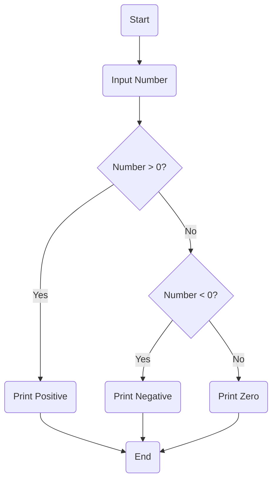

# Control Flow — If, Else, Elif Patterns

### 🧠 FOUNDATIONAL THEORY

#### 1\. **Decision-Making in Programs**

Imagine your daily life. You constantly make decisions: "If it's raining, I'll take an umbrella. Else, I'll walk without one." Or, "If I finish my work early, I can watch a movie. Otherwise, I'll keep working." These choices, based on certain conditions, guide your actions.

Just like us, computer programs need to make decisions to adapt to different situations, process varied inputs, and execute specific tasks. This ability to make choices is the core of **conditional logic** or **decision-making** in programming.

**Why Conditional Logic Exists:**

1.  **Adaptability:** Programs aren't static. They interact with users, data, and external systems that constantly change. Conditional logic allows a program to respond dynamically to these changes.
      * *Example:* A website might show a "Login" button if a user is not authenticated, but a "Profile" link if they are.
2.  **Handling Diverse Inputs:** Not all inputs are the same. A program needs to behave differently based on the type, value, or format of data it receives.
      * *Example:* A calculator needs to perform addition if the user enters `+`, subtraction if `-`, and so on.
3.  **Error Handling & Validation:** Programs need to ensure data is valid and prevent crashes. Conditional logic helps check for erroneous inputs or unexpected states.
      * *Example:* Before dividing two numbers, a program should check if the divisor is zero to avoid a `ZeroDivisionError`.
4.  **Implementing Business Rules:** Most applications embody specific business rules, which are inherently conditional.
      * *Example:* "Customers spending over ₹5000 get a 10% discount."
5.  **Controlling Program Flow:** Conditional statements dictate the exact path of execution a program takes, skipping certain blocks of code and executing others based on conditions.

-----

**Mapping Real-World Decision Trees to `if/else` Structures:**

A powerful way to think about conditional logic is by visualizing real-world decision processes as "decision trees." Each branch represents a condition, and each leaf represents an action.

Let's take the "morning routine" example:

**Real-World Decision Tree:**

  * **Start:** Wake Up
      * **Condition:** Is it a weekday?
          * **YES:**
              * **Condition:** Do I have an early meeting?
                  * **YES:** Get dressed quickly.
                  * **NO:** Have a leisurely breakfast.
              * Go to work.
          * **NO (Weekend):**
              * Sleep in.
              * Do chores.
      * **End:** Day continues.

**Mapping to `if/else` Structure (Conceptual Code):**

```python
# Simplified Conceptual Code

is_weekday = True
has_early_meeting = False # Or True, depending on the day

if is_weekday:
    # This block executes only if it's a weekday
    if has_early_meeting: # Nested decision
        print("Get dressed quickly.")
    else:
        print("Have a leisurely breakfast.")
    print("Go to work.")
else:
    # This block executes only if it's NOT a weekday (i.e., weekend)
    print("Sleep in.")
    print("Do chores.")

print("Day continues.")
```

**Key Takeaways from Mapping:**

  * **Conditions:** Real-world questions ("Is it raining?", "Is it a weekday?") become **Boolean expressions** (expressions that evaluate to `True` or `False`).
  * **Actions:** What you do based on the answer ("Take umbrella," "Go to work") become **blocks of code** that execute if the condition is met.
  * **Alternatives:** The "otherwise" or "else" scenarios are handled by `else` or `elif` (else if) clauses, ensuring that different paths are taken based on different conditions.
  * **Nesting:** Decisions can be nested within other decisions, just like branches on a tree can have sub-branches.

-----

**Flowchart to Code Mapping:**

Flowcharts are visual diagrams that represent the steps and decisions in a process. They are excellent tools for designing and understanding control flow before writing actual code.

**Common Flowchart Symbols:**

  * **Oval (Terminal):** Start or End of a process.
  * **Rectangle (Process):** An action or operation.
  * **Diamond (Decision):** A point where a decision is made, usually with "Yes/No" or "True/False" branches.
  * **Arrow (Flow Line):** Indicates the direction of flow.

**Example: Check if a number is positive, negative, or zero.**

**Flowchart:**




**Mapping to Python `if/elif/else` Code:**

```python
# Python Code
number = float(input("Enter a number: ")) # Input Number

if number > 0: # Number > 0? (Decision Diamond)
    print("Positive") # Print "Positive" (Process Rectangle)
elif number < 0: # Number < 0? (Decision Diamond)
    print("Negative") # Print "Negative" (Process Rectangle)
else: # If neither of the above conditions is met
    print("Zero") # Print "Zero" (Process Rectangle)

# The program naturally ends after one path is executed.
```

**Key Principles for Flowchart-to-Code:**

  * **Diamond Shapes** directly translate to `if` or `elif` statements, representing a condition.
  * **Rectangles** translate to the code blocks (indented lines) that execute if a condition is met.
  * **Flow Lines** indicate the sequence of execution. Multiple lines converging into one point (e.g., to `End`) show that different paths eventually lead to the same subsequent step.

Understanding this mapping helps you break down complex logic into manageable, visual steps, making it easier to write correct and efficient conditional code.

#### 2\. **Boolean Evaluation (Deep Dive)**

In Python, everything is an object, and every object has a truth value. Understanding how Python determines this truth value—and how it evaluates expressions built from them—is crucial for writing robust and efficient conditional logic.

-----

**The `bool()` Constructor and Implicit Casting Rules**

The `bool()` constructor is a built-in function that explicitly converts a value into its Boolean equivalent, `True` or `False`. While you can always call `bool(value)`, Python also performs this conversion implicitly in conditional statements.

The rules for what is considered **Falsy** (evaluates to `False`) and **Truthy** (evaluates to `True`) are fundamental:

**Falsy Values:**

  * `None`: The null object.
  * `False`: The Boolean false value.
  * Numeric zero of all types: `0`, `0.0`, `0j` (complex).
  * Empty sequences: `''` (empty string), `()` (empty tuple), `[]` (empty list), `{}` (empty dictionary), `set()` (empty set).
  * Empty ranges: `range(0)`.
  * Objects with a `__bool__()` method that returns `False` or a `__len__()` method that returns `0`.

**Truthy Values:**

  * **Anything that is not Falsy.** This includes:
  * `True`: The Boolean true value.
  * Non-zero numbers: `1`, `42`, `-1`, `3.14`.
  * Non-empty sequences or collections: `"hello"`, `(1, 2)`, `[1]`, `{"key": "value"}`.
  * Any custom object that doesn't define a `__bool__()` or `__len__()` method, or whose `__bool__()` method returns `True`.

**Example:**

```python
x = 5
y = ""
z = [1, 2]
d = {}

print(f"Is x (5) Truthy? {bool(x)}")     # Output: Is x (5) Truthy? True
print(f"Is y (empty string) Falsy? {bool(y)}") # Output: Is y (empty string) Falsy? False
print(f"Is z ([1, 2]) Truthy? {bool(z)}") # Output: Is z ([1, 2]) Truthy? True
print(f"Is d (empty dict) Falsy? {bool(d)}") # Output: Is d (empty dict) Falsy? False

# Implicit casting in an if statement
if d:
    print("This will not be printed because d is an empty dictionary.")
else:
    print("d is falsy, so this is printed.")
```

-----

**Operator Precedence in Boolean Logic**

When a condition involves multiple logical operators, Python follows a strict order of precedence to determine which operation to perform first.

From highest precedence to lowest:

1.  **`not`**: Unary logical NOT.
2.  **`and`**: Logical AND.
3.  **`or`**: Logical OR.

This means `not` binds most tightly, followed by `and`, and finally `or`. You can always override this default order with parentheses `()`.

**Example:**

```python
A = True
B = False
C = False

# Expression: not A or B and C
# This is evaluated as: (not A) or (B and C)
#
# Step 1: `not A` -> `not True` -> `False`
# Step 2: `B and C` -> `False and False` -> `False`
# Step 3: `False or False` -> `False`
result = not A or B and C
print(f"Result of 'not A or B and C' is: {result}") # Output: False

# Using parentheses to change precedence
result_with_parens = not (A or B) and C
# Step 1: `(A or B)` -> `(True or False)` -> `True`
# Step 2: `not (True)` -> `False`
# Step 3: `False and C` -> `False and False` -> `False`
print(f"Result of 'not (A or B) and C' is: {result_with_parens}") # Output: False

# Let's try another one where precedence matters more
A = True
B = False
C = True
result = not B or A and C
# (not B) or (A and C)
# -> (True) or (True)
# -> True
print(f"Result of 'not B or A and C' is: {result}") # Output: True
```

**Key Takeaway:** If you are ever in doubt about the order of evaluation, use parentheses to make your intentions explicit and your code more readable.

-----

**Internals: How Python Evaluates Composite Conditions**

Python's evaluation of Boolean expressions is highly optimized and often uses a technique called **short-circuiting**. This means that not all parts of a composite condition are necessarily evaluated. The evaluation stops as soon as the final outcome is known.

  * **For `and`:** The expression `A and B` is evaluated from left to right.
      * If `A` is **Falsy**, Python stops immediately and returns the value of `A`. It doesn't even look at `B`.
      * If `A` is **Truthy**, Python then evaluates `B` and returns the value of `B`.
  * **For `or`:** The expression `A or B` is evaluated from left to right.
      * If `A` is **Truthy**, Python stops immediately and returns the value of `A`. It doesn't even look at `B`.
      * If `A` is **Falsy**, Python then evaluates `B` and returns the value of `B`.
  * **For `not`:** `not A` always evaluates `A` first and then returns `False` if `A` is Truthy, or `True` if `A` is Falsy. There is no short-circuiting.

**Important Note:** The short-circuiting behavior means that `and` and `or` don't always return a Boolean (`True` or `False`). They return the value of the last expression evaluated.

**Example of Short-Circuiting with Side Effects:**

```python
def check_connection():
    print("Checking network connection...")
    return False

def check_database():
    print("Checking database status...")
    # This function will never be called due to short-circuiting
    return True

# A and B: 'A' is Falsy, so the expression stops at 'A'
print("\n--- Testing `and` short-circuit ---")
result_and = check_connection() and check_database()
print(f"Result of `and`: {result_and}") # The result is the value of check_connection(), which is False

def get_username():
    print("Getting username...")
    return "Alice"

def get_default():
    print("Getting default user...")
    # This function will never be called
    return "Guest"

# A or B: 'A' is Truthy, so the expression stops at 'A'
print("\n--- Testing `or` short-circuit ---")
result_or = get_username() or get_default()
print(f"Result of `or`: {result_or}") # The result is the value of get_username(), which is "Alice"
```

**Key Takeaway:** Short-circuiting is a powerful optimization that prevents unnecessary computation and is often used to write clean, Pythonic code, such as `if my_list and my_list[0] == 42:`. This prevents an `IndexError` if the list is empty.
